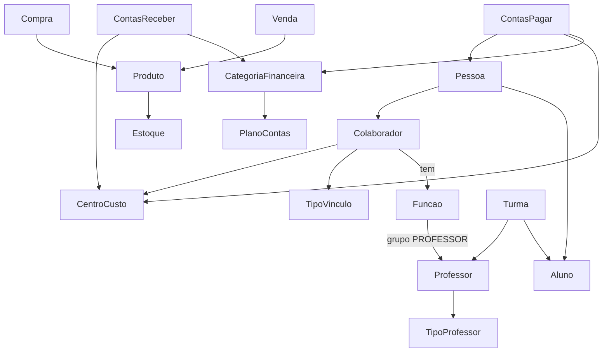

# Visão Geral do Sistema Conexão Dança
**Análise gerada em:** 2025-11-27 — 01:05:54 (GMT-3)

## 1. Visão geral do sistema
O Conexão Dança é uma plataforma administrativa que integra academia de dança, loja e café, além de operações financeiras e CRM. A aplicação é construída em Next.js (App Router) e usa Supabase como backend de dados e autenticação, expondo páginas privadas por contexto (acadêmico, financeiro, comercial, calendário, captação, movimento social e configuração administrativa).

## 2. Estrutura de pastas
- `src/app`: rotas Next.js (públicas e `(private)`), APIs em `src/app/api`.
- `src/app/(private)`: áreas internas (acadêmico, financeiro, comercial, pessoas, turmas, movimento, comunicação, calendário, configurações, etc.).
- `src/components`: componentes compartilhados (sidebar, cards, formulários, botões, avatar).
- `src/lib`: utilitários (supabase server/browser, auditoria).
- `docs`: documentação de apoio (modelo financeiro, rastreabilidade, cards acadêmicos etc.).

## 3. Principais rotas de páginas (Next.js)
- Autenticação: `/login`
- Home privada: `/`
- Acadêmico: `/academico/cursos`, `/academico/niveis`, `/academico/modulos`, `/academico/habilidades`, `/academico/avaliacoes`, `/academico/turmas`, `/academico/turmas/nova`, `/academico/turmas/grade`
- Financeiro admin/operacional: `/administracao/financeiro/*`, `/financeiro/*`
- Configuração: `/config/*` (escola, endereços, usuários, perfis, permissões, contratos, integrações, colaboradores, tipos de vínculo, professores)
- Comercial: `/comercial/loja/*`, `/comercial/ballet-cafe/*`
- Pessoas: `/pessoas`, `/pessoas/nova`, `/pessoas/[id]`
- Calendário: `/calendario/*`
- Captação: `/captacao/*`
- Movimento social: `/movimento/*`
- Relatórios: `/relatorios/*`
- Turmas (privado): `/turmas`, `/turmas/frequencia`, `/turmas/grade`, `/turmas/nova`

## 4. Rotas de API (principais)
- Alunos: `src/app/api/alunos/route.ts`, `[id]/route.ts`
- Auditoria: `src/app/api/auditoria/route.ts`, `/auditoria/log/route.ts`
- Cobranças: `src/app/api/cobrancas/route.ts`
- Pessoas: `src/app/api/pessoas/route.ts`, `[id]/route.ts`, `[id]/foto/route.ts`
- Professores: `src/app/api/professores/route.ts`, `[id]/route.ts`
- Turmas: `src/app/api/turmas/route.ts`
- Usuários a partir de pessoa: `src/app/api/usuarios/create-from-pessoa/route.ts`
- Rotas de teste/debug: `/api/teste`, `/api/_debug-user`

## 5. Domínios e entidades principais
- Pessoas/Alunos/Interessados: `pessoas`, `alunos`; telas `/pessoas/*`; relaciona com matrículas e financeiro.
- Colaboradores/Professores: `colaboradores`, `tipos_vinculo_colaborador`, `colaborador_funcoes`, `funcoes_colaborador`, `professores`, `tipos_professor`.
- Acadêmico: `cursos`, `niveis`, `modulos`, `habilidades`, `avaliacoes`, `turmas`, frequência, currículo.
- Financeiro: `centros_custo`, `categorias_financeiras`, `plano_contas`, `contas_pagar`, `contas_receber`, `movimento`/`lancamentos`.
- Comercial: loja e café (produtos, categorias, estoque, vendas, compras, pedidos).
- Captação/Movimento: CRM de interessados e ações sociais.
- Comunicação: e-mails/mensagens/templates.
- Relatórios/Auditoria: páginas `/relatorios/*` e API de auditoria.

## 6. Integração com banco de dados
- Supabase JS client (server/browser) com helpers em `src/lib/supabaseClient.ts` e `src/lib/supabaseBrowser.ts`; APIs usam client admin.
- Tabelas frequentes em telas: `pessoas`, `alunos`, `professores`, `colaboradores`, `tipos_vinculo_colaborador`, `funcoes_colaborador`, `centros_custo`, `categorias_financeiras`, `plano_contas`, `contas_pagar`, `contas_receber`, `movimento`, `cursos`, `niveis`, `modulos`, `habilidades`, `avaliacoes`, `turmas`, `cobrancas`, `auditoria`.
- Formulários/combos carregam listas via Supabase; inserts/updates ocorrem direto pelo client ou rotas de API server-side.

## 7. Fluxos críticos do sistema
- Cadastro/Edição de Pessoas: telas `/pessoas/nova` e `/pessoas/[id]` gravam em `pessoas` via Supabase ou API `/api/pessoas`.
- Cadastro de Colaboradores: `/config/colaboradores` usa pessoas/tipos de vínculo/centros e grava em `colaboradores`; funções em `colaborador_funcoes` (e `professores` se grupo PROFESSOR).
- Criação de Turmas e Matrículas: telas `/academico/turmas/*` CRUD em `turmas`; vínculos de alunos evoluem para `matriculas` + `turma_aluno`.
- Contas a pagar/receber: telas `/administracao/financeiro/contas-pagar` e `/contas-receber` gravam em `contas_pagar`/`contas_receber` com categorias/centros/pessoas.
- Movimentação financeira/caixa: `/administracao/financeiro/movimento` e `/financeiro/caixa` exibem e registram lançamentos em `movimento`.

## 8. Diagrama textual (alto nível)

## 9. Pontos de atenção e sugestões
- Há muitas páginas ainda com placeholders; à medida que regras de negócio crescem, centralizar acessos Supabase em camadas de dados por domínio.
- Padronizar componentes de formulários (combobox, estados ativo/inativo) e tipos TypeScript compartilhados.
- Documentar dependências financeiro ↔ acadêmico (centros/categorias vs. turmas) e colaboradores ↔ professores.
- Considerar testes de integração para APIs críticas (pessoas, alunos, financeiro).

## 📆 Histórico de mudanças recentes (resumo técnico)

- **2025-12-02 — Etapa 1 da migração de Matrículas**
  - Criada a tabela canônica `matriculas`, centralizando o vínculo entre Pessoa (aluno), Turma/Projeto, Plano de Matrícula e Contrato/Financeiro.
  - Ajustada a tabela `turma_aluno` para ter FK explícita `aluno_pessoa_id → pessoas(id)` e a coluna `matricula_id → matriculas(id)`, mantendo índices por pessoa e matrícula.
  - As tabelas `alunos` e `alunos_turmas` permanecem como legado, sem migração de dados nesta etapa.
