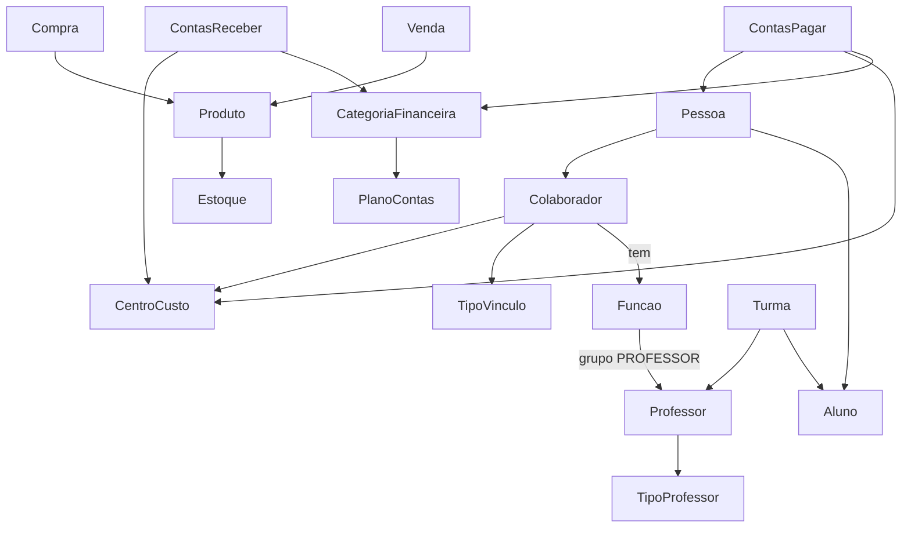

# Visão Geral do Sistema Conexão Dança  
**Análise gerada em:** `2025-11-27 — 01:05:54`  
*(Horário local — Brasil, GMT-3)*

## 1. Visão geral do sistema
O Conexão Dança é uma plataforma administrativa que integra academia de dança, loja e café, além de operações financeiras e CRM. A aplicação é construída em Next.js (App Router) e usa Supabase como backend de dados e autenticação, expondo páginas privadas por contexto (acadêmico, financeiro, comercial, calendário, captação, movimento social e configuração administrativa).

O sistema organiza pessoas, alunos, colaboradores e professores; controla turmas, matrículas e frequência; gerencia vendas de loja e lanchonete; e mantém contas a pagar/receber com centros de custo, categorias e plano de contas. Há também recursos de comunicação (e‑mails/templates), relatórios e auditoria.

## 2. Estrutura de pastas
- `src/app`: rotas Next.js. Divide entre rotas públicas e a pasta `(private)` com contextos internos (acadêmico, financeiro, comercial, captação, movimento, comunicação, calendário, configuração, etc.). Contém também rotas de API em `src/app/api`.
- `src/app/(private)`: agrupador das áreas internas; subpastas para acadêmico, administração/financeiro, config, comercial, pessoas, turmas, movimento, comunicação, calendário, etc.
- `src/components`: componentes compartilhados (Sidebar, FinanceHelpCard, formulários, botões, avatar, app shell, auth guard).
- `src/lib`: utilitários de infraestrutura (supabase client/browser, auditoria).
- `docs`: documentação de apoio (modelo financeiro, manual de uso financeiro, instruções de rastreabilidade, modelo de cards acadêmicos).
- Configurações: não há prisma; o acesso a banco é via Supabase (`src/lib/supabaseClient.ts`, `src/lib/supabaseBrowser.ts`). Variáveis vêm de `NEXT_PUBLIC_SUPABASE_URL` e `NEXT_PUBLIC_SUPABASE_ANON_KEY`.

## 3. Principais rotas de páginas (Next.js)
- `/login` (`src/app/login/page.tsx`): autenticação.
- `/` (layout `src/app/layout.tsx` + `(private)/page.tsx`): home/placeholder interna.
- Acadêmico: `/academico/cursos`, `/academico/niveis`, `/academico/modulos`, `/academico/habilidades`, `/academico/avaliacoes`, `/academico/frequencia`, `/academico/turmas`, `/academico/turmas/grade`, `/academico/turmas/nova`, `/academico/filtro`.
- Financeiro (Admin): `/administracao/financeiro` (dashboard), `/administracao/financeiro/centros-custo`, `/administracao/financeiro/categorias`, `/administracao/financeiro/plano-contas`, `/administracao/financeiro/contas-pagar`, `/administracao/financeiro/contas-receber`, `/administracao/financeiro/movimento`, `/administracao/financeiro/lancamentos-manuais`.
- Financeiro (operacional): `/financeiro/pagar`, `/financeiro/receber`, `/financeiro/caixa`, `/financeiro/movimentacao`, `/financeiro/cobrancas/nova`, `/financeiro/cobrancas/[id]`.
- Configuração: `/config/escola`, `/config/enderecos`, `/config/usuarios`, `/config/perfis`, `/config/permissoes`, `/config/contratos`, `/config/integacoes`, `/config/comercial/loja`, `/config/comercial/ballet-cafe`, `/config/colaboradores`, `/config/colaboradores/tipos-vinculo`, `/config/escola/professores`.
- Comercial: `/comercial/loja/*` (produtos, estoque, vendas, compras, pedidos, financeiro, relatórios), `/comercial/ballet-cafe/*` (categorias, produtos, estoque, vendas, compras, financeiro, relatórios).
- Pessoas: `/pessoas`, `/pessoas/nova`, `/pessoas/[id]`, `/pessoas/colaboradores`, `/pessoas/interessados`.
- Calendário: `/calendario`, `/calendario/eventos-internos`, `/calendario/eventos-externos`, `/calendario/feriados`.
- Captação: `/captacao`, `/captacao/novo`, `/captacao/interessados`.
- Movimento social: `/movimento/bolsas`, `/movimento/acolhimento`, `/movimento/acoes`, `/movimento/informacoes-sociais`.
- Relatórios: `/relatorios`, `/relatorios/auditoria`.
- Turmas (privado): `/turmas`, `/turmas/frequencia`, `/turmas/grade`, `/turmas/nova`.

Cada página traz formulário/lista coerente com o domínio: criação/edição, filtros e tabelas.

## 4. Rotas de API
- `src/app/api/alunos/route.ts` e `[id]/route.ts`: CRUD de alunos.
- `src/app/api/auditoria/route.ts` e `/auditoria/log/route.ts`: registro e consulta de logs de auditoria.
- `src/app/api/cobrancas/route.ts`: operações de cobranças financeiras.
- `src/app/api/pessoas/route.ts`, `[id]/route.ts`, `[id]/foto/route.ts`: CRUD de pessoas e upload de foto.
- `src/app/api/professores/route.ts`, `[id]/route.ts`: CRUD de professores.
- `src/app/api/turmas/route.ts`: CRUD de turmas.
- `src/app/api/usuarios/create-from-pessoa/route.ts`: cria usuário a partir de pessoa.
- `src/app/api/teste/route.ts`: rota de teste.
- `src/app/api/_debug-user/route.ts`: depuração de usuário.
Todas utilizam Supabase Admin Client (server-side) via `createClient` com chaves de ambiente.

## 5. Domínios e entidades principais
- Pessoas/Alunos/Interessados: `pessoas`, `alunos`, páginas em `/pessoas/*`, APIs de pessoas e alunos; relaciona-se com matrícula e financeiro.
- Colaboradores e Professores: `colaboradores`, `tipos_vinculo_colaborador`, `colaborador_funcoes`, `funcoes_colaborador`, `professores`, `tipos_professor`; telas `/config/colaboradores`, `/config/colaboradores/tipos-vinculo`, `/config/escola/professores`.
- Acadêmico: entidades `cursos`, `niveis`, `modulos`, `habilidades`, `avaliacoes`, `turmas` (páginas em `/academico/*`, `/turmas/*`), frequências e currículos.
- Financeiro: `centros_custo`, `categorias_financeiras`, `plano_contas`, `contas_pagar`, `contas_receber`, `movimento`/`lancamentos`; telas em `/administracao/financeiro/*` e operacional `/financeiro/*`.
- Comercial: loja e café (`produtos`, `categorias`, `estoque`, `vendas`, `compras`, `pedidos`) sob `/comercial/loja/*` e `/comercial/ballet-cafe/*`.
- Captação/Movimento: telas de CRM (`captacao`) e ações sociais (`movimento`), referenciando interessados e informações sociais.
- Comunicação: `emails`, `mensagens`, `templates` em `/comunicacao/*`.
- Relatórios/Auditoria: páginas `/relatorios/*` e API de auditoria.
Relações importantes: Pessoa → (Aluno | Colaborador | Interessado); Colaborador → Funções → Professor (grupo PROFESSOR) → Tipos de Professor; Contas a pagar/receber → Categoria (ligada a plano_contas) e Centro de custo.

## 6. Integração com banco de dados
- Conexão: Supabase JS client (`src/lib/supabaseClient.ts`) com URL/chave pública e helper de componentes (`src/lib/supabaseBrowser.ts`). APIs usam `createClient` no server (admin). Sessão/estado por `@supabase/auth-helpers-nextjs`.
- Tabelas vistas no código: `pessoas`, `alunos`, `professores`, `tipos_professor`, `colaboradores`, `tipos_vinculo_colaborador`, `funcoes_colaborador`, `colaborador_funcoes`, `centros_custo`, `categorias_financeiras`, `plano_contas`, `contas_pagar`, `contas_receber`, `movimento`/`lancamentos`, `produtos`, `estoque`, `vendas`, `compras`, `pedidos`, `cursos`, `niveis`, `modulos`, `habilidades`, `avaliacoes`, `turmas`, `frequencia`, `cobrancas`, `auditoria` (logs).
- Uso nas telas: formulários/comboboxes carregam listas (pessoas, centros, tipos de vínculo, categorias, plano de contas); inserções/updates são feitas direto via Supabase client nas páginas; APIs fornecem CRUD server-side para alunos, pessoas, turmas, professores, cobranças, auditoria.

## 7. Fluxos críticos do sistema
- Cadastro/Edição de Pessoas: Tela `/pessoas/nova` ou `/pessoas/[id]` → formulário envia para Supabase (pessoas) ou API `/api/pessoas` → tabela `pessoas`.
- Cadastro de Colaboradores: Tela `/config/colaboradores` → carrega pessoas/tipos de vínculo/centros → salva em `colaboradores`; card de funções grava em `colaborador_funcoes` (e `professores` se grupo PROFESSOR).
- Criação de Turmas e Matrículas: Telas em `/academico/turmas` e `/turmas/*` → CRUD de turmas via API `/api/turmas` → tabelas `turmas` (possível relação a alunos/matrículas e frequência).
- Contas a pagar/receber: Telas `/administracao/financeiro/contas-pagar` e `/contas-receber` → formulário com categoria (categorias_financeiras), centro de custo e pessoa/credor → grava em `contas_pagar`/`contas_receber` com valores em centavos; listagens formatam em R$.
- Movimentação financeira/caixa: Páginas `/administracao/financeiro/movimento` e `/financeiro/caixa` → exibem e registram lançamentos em `movimento`/`lancamentos` (referenciando centros/categorias).

## 8. Diagrama textual

## 9. Pontos de atenção e sugestões
- Organização: Contextos separados em `(private)` e componentes compartilhados ajudam a manter consistência visual (FinanceHelpCard, Sidebar). Domínios principais estão divididos por pasta, o que facilita onboarding.
- Complexidade futura: há muitas páginas geradas com placeholders mínimos; conforme os domínios ganham regras, será importante centralizar serviços de dados (hooks/clients) para evitar lógica duplicada de Supabase em cada página. A padronização de comboboxes com busca e de tratamento de “ativo/inativo” deve virar componentes reutilizáveis.
- Sugestões: criar camada de data-access (hooks por domínio) para encapsular queries; definir modelos TypeScript compartilhados em `src/lib/types`; documentar dependências entre financeiro e acadêmico (centros/categorias vs. turmas) e entre colaboradores/professores; adicionar testes de integração para APIs críticas (pessoas, alunos, financeiro).

Arquivo atualizado com sucesso: `docs/visao-geral-sistema-conexao-danca.md`.
